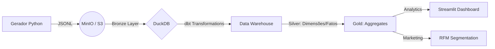

# LuisBank Data Platform

[]()
[]()
[]()

> Uma plataforma de dados End-to-End simulando a operação de um Banco Digital, o **LuisBank**, construída como camada analítica sobre o projeto transacional [Immutable Ledger](https://github.com/ricardoribs/immutable-ledger), cobrindo desde a ingestão de eventos financeiros até Analytics avançado de CRM (RFM) e Compliance.

---

## Arquitetura da Solução

O projeto segue a arquitetura Modern Data Stack focada em alta performance local e baixo custo, utilizando processamento in-process (DuckDB).



---

## Tech Stack

| Componente     | Tecnologia                | Função                                                               |
| -------------- | ------------------------- | -------------------------------------------------------------------- |
| Ingestion      | Python (Faker, Pydantic)  | Geração de dados sintéticos com integridade referencial e contratos. |
| Data Lake      | MinIO (Docker)            | Armazenamento de objetos (S3 Compatible).                            |
| Processing     | DuckDB                    | Motor OLAP de alta performance (Zero-Copy).                          |
| Transformation | dbt Core                  | Modelagem dimensional, testes de qualidade e linhagem.               |
| Visualization  | Streamlit + Plotly        | Data App interativo para executivos e operação.                      |
| Orchestration  | Makefile / Github Actions | Automação de pipeline e CI/CD.                                       |

---

## Inteligência de Negócio (Business Logic)

O projeto não apenas processa dados, mas gera valor através de regras de negócio complexas:

### 1. Segmentação RFM (Recency, Frequency, Monetary)

Algoritmo SQL (ntile) para classificar clientes em quintis.

Categorias: Champions, Loyal, Promising, At Risk, Hibernating.

### 2. Auditoria & Compliance

Monitoramento de transações acima de R$ 5k.

Detecção de outliers transacionais.

### 3. Data Quality

Testes de unicidade (unique) e não-nulos (not_null).

Validação de chaves estrangeiras entre Contas e Transações.

---

## Como Rodar Localmente

### Pré-requisitos

Docker & Docker Compose

Python 3.10+

Git

### Passo a Passo

#### 1. Clone o repositório

```bash
git clone https://github.com/ricardoribs/luisbank-data-platform.git
cd luisbank-data-platform
```

#### 2. Setup do Ambiente

```bash
# Cria ambiente virtual e instala libs
make setup
```

#### 3. Inicie a Infraestrutura (Data Lake)

```bash
make infra-up
```

#### 4. Pipeline Completo (Ingestão -> Transformação)

```bash
# Gera dados, sobe pro MinIO, roda dbt run e dbt test
make pipeline
```

#### 5. Acesse o Dashboard

```bash
make dashboard
```

Acesse em: [http://localhost:8501](http://localhost:8501)

---

## Estrutura do Projeto

```
luisbank-data-platform/
├── data/                  # Arquivos locais (DuckDB, JSONLs)
├── dbt_project/           # Projeto de Transformação
│   ├── models/
│   │   ├── staging/       # View em cima do Data Lake (Bronze)
│   │   ├── marts/         # Tabela Fato e Dimensões (Silver/Gold)
│   │   └── marketing/     # Segmentação RFM
│   └── tests/             # Testes de qualidade de dados
├── infrastructure/        # Arquivos Docker/Terraform
├── src/
│   ├── generators/        # Scripts Python (Faker)
│   └── dashboard/         # Aplicação Streamlit
├── Makefile               # Automação de comandos
└── docker-compose.yml     # Infraestrutura MinIO
```

---

## Resultados Visuais

### 1. Dashboard Executivo (Streamlit)
Visão consolidada de KPIs financeiros com cálculo de deltas e tendências temporais.


### 2. Segmentação Inteligente (RFM)
Aplicação de lógica de negócio (SQL Window Functions) para classificar clientes em clusters (Champions, At Risk, etc) e gerar listas de ação para o Marketing.


### 3. Engenharia & Linhagem (dbt)
Pipeline de dados estruturado em camadas (Bronze, Silver, Gold) garantindo rastreabilidade e qualidade.
