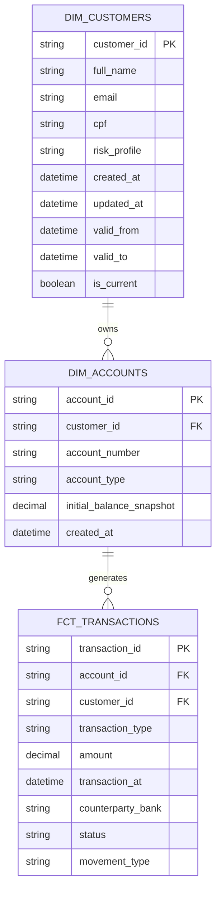

# ERD - Modelo Dimensional

```mermaid
erDiagram
    DIM_CUSTOMERS {
        string customer_id PK
        string full_name
        string email
        string cpf
        string risk_profile
        datetime created_at
        datetime updated_at
        datetime valid_from
        datetime valid_to
        boolean is_current
    }

    DIM_ACCOUNTS {
        string account_id PK
        string customer_id FK
        string account_number
        string account_type
        decimal initial_balance_snapshot
        datetime created_at
    }

    FCT_TRANSACTIONS {
        string transaction_id PK
        string account_id FK
        string customer_id FK
        string transaction_type
        decimal amount
        datetime transaction_at
        string counterparty_bank
        string status
        string movement_type
    }

    DIM_CUSTOMERS ||--o{ DIM_ACCOUNTS : owns
    DIM_ACCOUNTS ||--o{ FCT_TRANSACTIONS : generates
```
